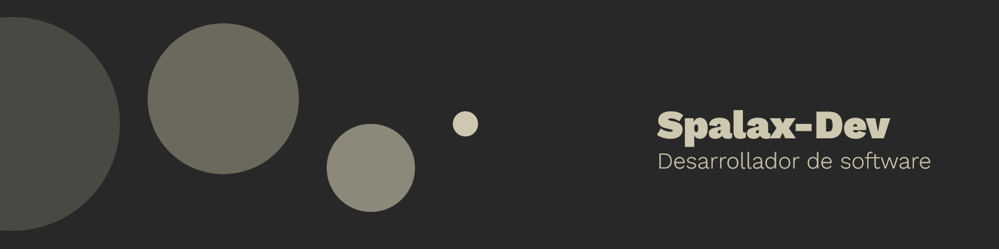

  

# ¡Hola! Mi nombre es Jorge Iván

Soy un **estudiante de Ingeniería de Sistemas y Computación** en la **Universidad del Quindío**. Más que programar, me gusta proponer y desarrollar soluciones, y es que para mí eso es lo mejor del desarrollo de software: el entender las necesidades de las personas y diseñar soluciones en consecuencia.

## Contacto

**Muchas gracias por revisar mi perfil**
